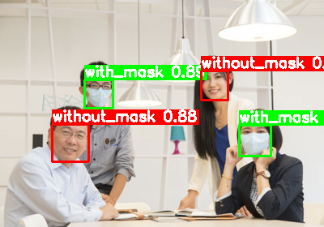

# FaceMaskDetection




## 项目介绍

本项目是一个基于 YOLOv8 的口罩检测系统，支持检测三种状态：正确佩戴口罩、未佩戴口罩、口罩佩戴不规范。本系统提供完整的训练流程和灵活的预测接口，适用于实时视频流、图片文件、摄像头输入等多种场景。旨在通过深度学习技术实现对图像和视频中人物是否正确佩戴口罩的高效、准确检测。可用于公共场所监控、门禁系统等场景，助力疫情防控与公共卫生管理。
## 功能特点

  1. **高效的数据集处理** ：支持从 Kaggle 下载数据集，并自动完成 VOC 格式到 YOLO 格式的转换，以及数据集的划分，极大简化了数据预处理流程。
  2. **强大的模型训练** ：基于预训练模型 YOLOv8n 进行微调，通过 100 个训练周期，在 Tesla T4 GPU 上仅需 1.029 小时即可完成训练，且模型在验证集上取得了 excellent 的性能指标（mAP50-95 为 0.708）。
  3. **灵活的预测功能** ：支持对单张图片、视频文件、文件夹中的批量图片以及摄像头实时视频流进行口罩检测预测，并可根据需求选择是否保存预测结果。

## 目录结构

```
FaceMaskDetection/
├── baseModel/                 # 预训练模型
├── dataset/                   # 口罩数据集
├── predict/                   # 预测保存位置
├── runs/                      # 保存的参数文件
├── .gitignore                 # Git 忽略文件配置
├── main.py                    # 训练预测 main 文件
├── model_train_predict.ipynb  # 数据集下载模型训练预测脚本
├── README.MD                  # 项目说明文档
├── voc.yaml                   # 数据集配置文件
└── yolov8n.pt                 # YOLOv8 预训练模型权重文件
```

## 环境依赖

  1. **Python** ：3.11.12
  2. **PyTorch** ：2.6.0+cu124
  3. **其他依赖库** ：kagglehub、ultralytics、opencv-python、matplotlib 等

可通过以下命令安装项目依赖：

```bash
pip install python依赖包
```

## 快速开始

### 数据准备

  1. **下载数据集** ：运行 `main.py` 文件中的 `download_dataset` 函数，项目将自动从 Kaggle 下载 “andrewmvd/face-mask-detection” 数据集并解压到 `dataset` 目录下。
  2. **数据集转换与划分** ：调用 `prepare_dataset` 函数，将 VOC 格式的标注文件转换为 YOLO 格式，并按照 8:2 的比例将数据集划分为训练集和测试集，分别存储在 `dataset/output/train` 和 `dataset/output/test` 目录中。

### 模型训练

在完成数据准备后，使用以下代码进行模型训练：

```python
model = YOLO("baseModel/yolov8n.pt")  # 使用预训练模型
model.train(
    data="voc.yaml",
    device=0 if device == "cuda" else "cpu",
    epochs=100,                  # 增加总训练轮次
    batch=32,                    # 减小 batch size 以适应更大分辨率
    imgsz=800,                   # 优化显存使用（800->640）
    optimizer="AdamW",
    lr0=0.0005,                    # 降低初始学习率
    lrf=0.005,                    # 余弦退火最终学习率
    warmup_epochs=3,   # 新增学习率预热
    weight_decay=0.05,           # 添加权重衰减防止过拟合

    # 数据增强强化
    augment=True,
    hsv_h=0.3,                   # 增强色调扰动
    hsv_s=0.6,                   # 增强饱和度扰动
    translate=0.2,               # 增大平移幅度
    scale=0.5,                   # 扩大缩放范围
    shear=0.3,                   # 增大剪切幅度
    mosaic=1.0,                  # 全程开启 mosaic
    close_mosaic=15,             # 最后 15 个 epoch 关闭 mosaic 稳定训练

    # 损失函数调整
    cls=3.0,                     # 增大分类损失权重
    box=1.5,                     # 增大框回归损失权重
    dfl=1.5,                     # 增大点框损失权重
    # fl_gamma=2.0,                # 聚焦困难样本（类似 focal loss）

    # obj=1.5,                     # 适当增大目标存在损失权重
    copy_paste=0.3,              # 新增复制粘贴增强（特别针对少数类）
    mixup=0.2,       # 新增 MixUp 增强（默认未启用）
    # 类别平衡策略
    # 需在 data.yaml 中添加：
    #   weights: [1.0, 1.0, 2.0, 4.0]  # 按类别样本量倒数设置权重
    #   sample_weights: True           # 启用样本加权采样

    # 训练控制
    patience=15,                  # 延长早停观察期
    dropout=0.3,                 # 添加 Dropout 正则化
    amp=True,                    # 保持混合精度训练
    pretrained=True,
    save=True,
    exist_ok=True,
)
```

训练过程中，模型会自动保存权重文件和训练日志，最终生成的最优模型权重文件存储在 `runs/detect/train/weights/best.pt` 中。

### 模型预测

  1. **单张图片预测** ：调用 `predict_image` 函数，传入图片路径即可得到预测结果，并可选择是否保存结果图片。
  2. **视频文件预测** ：使用 `predict_video` 函数对视频文件进行预测，同样支持结果保存功能。
  3. **文件夹批量图片预测** ：通过 `predict_folder` 函数可对文件夹中的所有图片进行批量预测，并按原文件夹结构保存预测结果。
  4. **摄像头实时预测** ：利用 `predict_camera` 函数开启摄像头实时检测功能，按 “q” 键可退出预测。

以下为预测功能的统一调用示例：

```python
run_predict(INPUT_PATH, SAVE, OUTPUT_PATH)
```

其中，`INPUT_PATH` 可为图片、视频、文件夹路径或摄像头编号，`SAVE` 表示是否保存预测结果，`OUTPUT_PATH` 为结果保存路径。

## 性能指标

  1. **训练性能** ：在 Tesla T4 GPU 上运行 100 个 epochs 仅需 1.029 小时，模型训练效率高。
  2. **验证性能** ：在验证集上，模型的 mAP50-95 为 0.708，各类别的 mAP50 和 mAP50-95 指标如下：

| Class              | mAP50  | mAP50-95 |
|--------------------|--------|----------|
| with_mask          | 0.981  | 0.727    |
| without_mask       | 0.963  | 0.667    |
| mask_weared_incorrect | 0.982  | 0.732    |

## 项目改进方向

  1. **模型优化** ：可尝试使用更先进的 YOLO 版本或其他目标检测算法，进一步提升检测精度和速度。
  2. **数据增强** ：继续丰富数据增强策略，如添加更多种类的几何变换、颜色变换等，以提高模型对不同场景和光照条件的适应能力。
  3. **实时性提升** ：针对实时视频流检测场景，进一步优化模型结构和推理流程，降低延迟，提高帧率。
  4. **部署扩展** ：将模型部署到移动设备、嵌入式系统等更多平台，实现更广泛的应用。

## 许可证

本项目遵循 MIT 开源协议，允许自由使用、修改和分发代码。

## 致谢

感谢 Ultralytics 提供的 YOLOv8 框架，以及 Kaggle 上 “andrewmvd/face-mask-detection” 数据集的作者，为本项目的开发提供了重要支持。